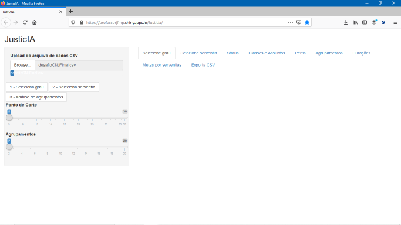
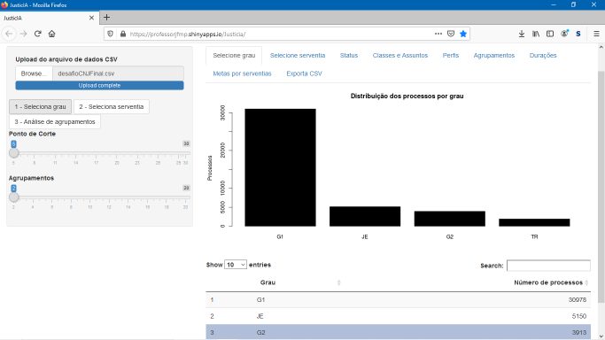
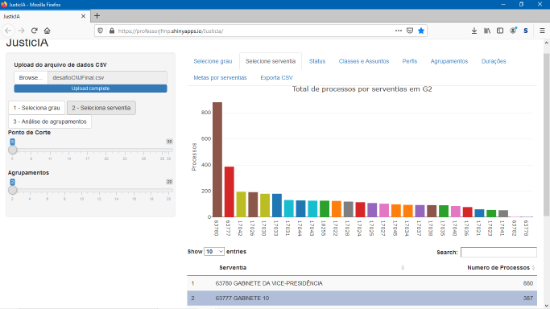
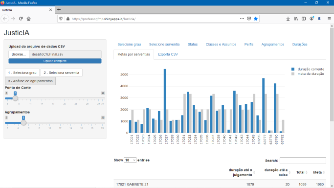

# Equipe Intellegentia (26)

# JusticIA - Inteligência dos dados aplicada ao Direito e em benefício da Sociedade.

O site do programa se encontra em [JusticIA](https://professorjfmp.shinyapps.io/Justicia/).

Para prova de conceito neste desafio, foram escolhidos os processos de graus G1, G2, TR e JE do Tribunal Federal da Segunda Região (TRF2).

O projeto foi dividido en três partes:
1.	Carga de dados não estruturados fornecidos pelo CNJ no Atlas MongoDB na nuvem correspondentes ao Tribunal Federal da Segunda Região (TRF2);
2.	Geração de arquivo DesafioCNJFinal.CSV cujas linhas correspondem aos processos e as colunas aos atributos filtrados da base fornecida, assim como a inclusão de atributos calculados (Programa escrito em Python que está no diretorio /python);
3.	Interface web em R/Shiny que lê o arquivo DesafioCNJFinal.CSV, executa toda a Inteligência Computacional e apresenta os resultados gráficos e tabulares (Os programas desta parte foram escritos em R e estão no diretorio /R);.

Instruções:
1.	Instalar bibliotecas do Python, pymongo e dnspython, para conexão com o MongoDB
2.	Conectar cliente com MongoDB
3.	Gerar arquivo DesafioCNJRaw.csv com processos filtrados e organizados por linhas (processos) e colunas (atributos)
4.	Abrir arquivo gerado na etapa 3 (DesafioCNJRaw.csv), aplicar a lógica de negócios e gerar arquivo de saída DesafioCNJInter.csv
5.	Abrir arquivo gerado na etapa 4 (DesafioCNJInter.csv), acrescentar informações textuais associadas a serventias, classes e assuntos e gerar o arquivo DesafioCNJFinal.CSV

Para executar o programa devemos seguir os seguintes passos:

1.	Primeiro, selecione o arquivo desejado e faça upload

2.	Depois, vá na aba "Selecione Grau", escolha um grau na tabela e clique em "1 -Seleciona Grau" no lado direito da tela

3.	Depois, vá na aba "Selecione Serventia", escolha uma serventia na tabela e clique em "2 -Seleciona Serventia" no lado direito da tela

4.	Por fim, escolha o "Ponto de Corte" e "Agrupamentos" desejados no lado direito da tela e veja os resultados nas abas "Agrupamentos","Durações" e "Metas por Serventia"

.
